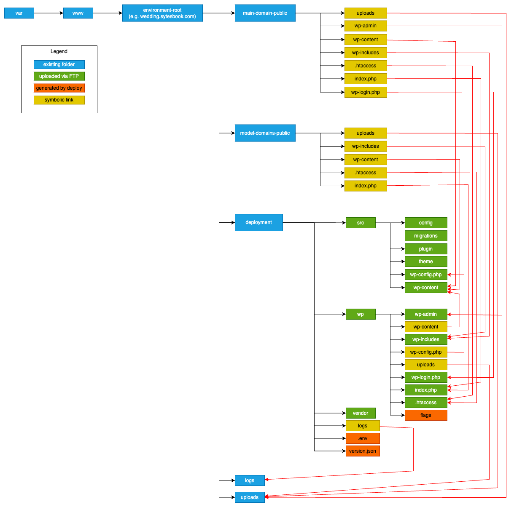

# Sytesbook WPWedding - Deploy

## Deployment to AWS LightSail instance

### Create AWS LightSail instance
* Login to AWS Management Console
* At Amazon LightSail go to `Create instance`
* Select `Linux`, `OS only`, `Ubuntu 24.04 LTS`
* Select size and press `Create instance`
* Attach static IP address to the created server
* Open the following ports on the server: 22 (SSH), 80 (HTTP), 443 (HTTPS)
* Connect to the server via SSH from the browser console
* Run `sudo apt update`
* Run `sudo apt full-upgrade`
* Reboot the server

### Install Apache Web Server
* Run `sudo apt install apache2`
* Try to browse `http://{your-ip-address}`. It should show the Apache2 default page

### Install MySQL Server
* Run `sudo apt install mysql-server`
* Run `sudo mysql_secure_installation`. This script will remove some insecure default settings and lock down access to your database system.
* Try login to MySQL with `sudo mysql`. You should see the MySQL prompt

### Install PHP
* Run `sudo apt install php libapache2-mod-php php-mysql`
* Check PHP version with `php -v`

### Create Directory Structure
Create the directory structure on the server as depicted on the image below by blue boxes:

### Setup Service Users, Groups & Permissions
Create the following service users for each environment {env}:
* `apache-{env}`: The corresponding Apache virtual host will be running as this user.
* `deploy-{env}`: The GitHub Actions workflow deploying to `{env}` will be running as this user.

Create the following group for each environment as the primary group of the users created above for that environment:
* `sytesbook-{env}`: The group owner of all directories inside the environment root.

Add the created users to the corresponding `sytesbook-{env}` group.
  
Set file permissions and ownerships of the directories inside each environment root:
* `main-domain-public`:
  * owner: `deploy-{env}`
  * group owner: `sytesbook-{env}`
  * permissions for directories: `rwxr-S--- (2740)`
  * permissions for files: `rw-r----- (0640)`
* `model-domains-public`:
  * owner: `deploy-{env}`
  * group owner: `sytesbook-{env}`
  * permissions for directories: `rwxr-S--- (2740)`
  * permissions for files: `rw-r----- (0640)`
* `deployment`:
  * owner: `deploy-{env}`
  * group owner: `sytesbook-{env}`
  * permissions for directories: `rwxr-S--- (2740)`
  * permissions for files: `rw-r----- (0640)`
* `uploads`:
  * owner: `apache-{env}`
  * group owner: `sytesbook-{env}`
  * permissions for directories: `rwxr-S--- (2740)`
  * permissions for files: `rw-r----- (0640)`
* `logs`:
  * owner: `apache-{env}`
  * group owner: `sytesbook-{env}`
  * permissions for directories: `rwxr-S--- (2740)`
  * permissions for files: `rw-r----- (0640)`

### Configure SSH
Temporarily enable password authentication on the server:
* Add the following line to `/etc/ssh/sshd_config.d/60-cloudimg-settings.conf` and `/etc/ssh/sshd_config`: `PasswordAuthentication yes` and `PubKeyAuthentication no`
* Restart SSH with `sudo systemctl restart ssh`
* Setup password for users `deploy-{env}`: `sudo passwd deploy-{env}`

Generate SSH key for user `deploy-{env}` on the local machine:
* `ssh-keygen -t rsa -b 2048 -C 'SSH keys for deploy-{env} on {server-name}'`

Upload the generated SSH key for user `deploy-{env}` to the server:
* `ssh-copy-id -i .ssh_sytesbook/deploy-{env}.pub deploy-{env}@{ip-address}`
* This will ask for password of deploy-{env}

Disable password authentication:
* Add the following line to `/etc/ssh/sshd_config.d/60-cloudimg-settings.conf` and `/etc/ssh/sshd_config`: `PasswordAuthentication no` and `PubKeyAuthentication yes`
* Restart SSH with `sudo systemctl restart ssh`

### Setup UMASK for `deploy-{env}` and `apache-{env}` users
* Calculate the necessary `umask` value:
  * default file permissions: `666 = 110110110`
  * default directory permissions: `777 = 111111111`
  * umasked file permissions: `640 = 110100000`
  * umasked directory permissions: `740 = 111100000`
  * umask value: `037 = 000011111`

* Turn on `pam_umask` module by appending the following line to `/etc/pam.d/common-session` (if doesn't exist yet): `session optional pam_umask.so`

* Add UMASK value to the GECOS field of the users in `/etc/passwd`:
  * `deploy-{env}:x:1000:1000:,,,umask=0037:/home/deploy-{env}:/bin/bash
  * `apache-{env}:x:1001:1001:,,,umask=0037:/nonexistent:/usr/sbin/nologin

## GitHub Actions Folder Structure
`repos/sytesbook-wpwedding` - Run `composer install`

`repos/sytesbook-wpwedding/wp` - Zip to `deploy/wp.zip`

`repos/sytesbook-wpwedding/src` - Zip to `deploy/wp_src.zip`

`repos/sytesbook-wpwedding/vendor` - Zip to `deploy/wp_src.zip`

`repos/sytesbook-wpwedding/wp/wp-content/themes/sytesbook-wpwedding` - Run `npm install` and `npm run build`

`repos/sytesbook-wpwedding-installer` - Required for `composer install`

`repos/sytes-react` - Required for `npm install` and `npm run build`

`deploy/wp.zip` - Upload and unzip to the public folder on the webserver

`deploy/wp_src.zip` - Upload and unzip to the private folder on the webserver
